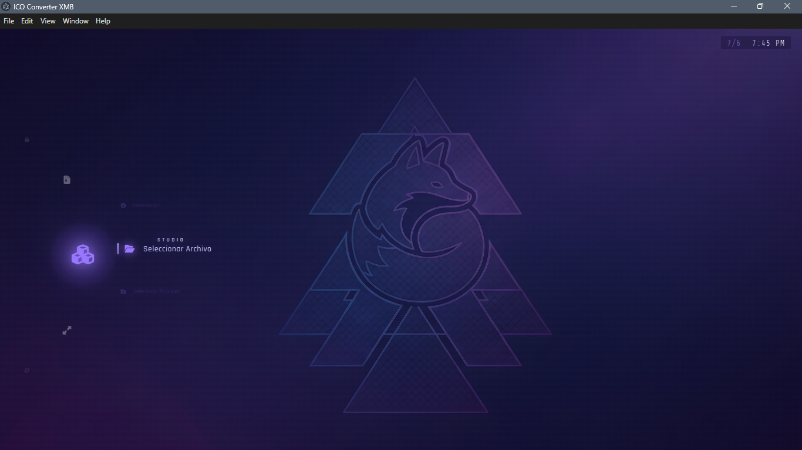
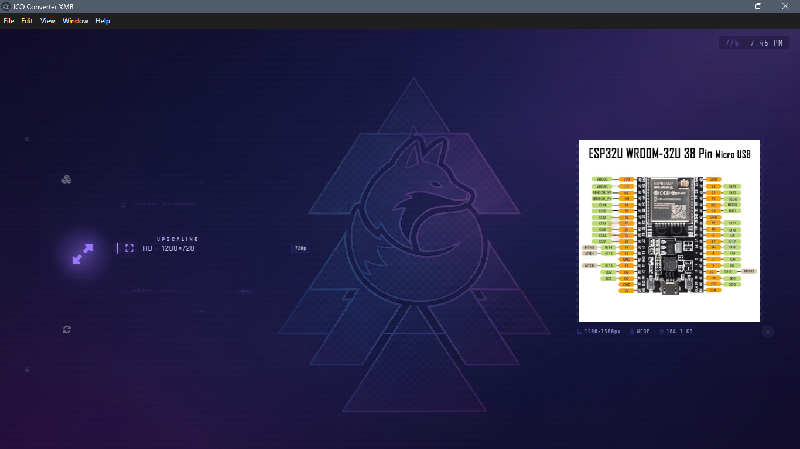
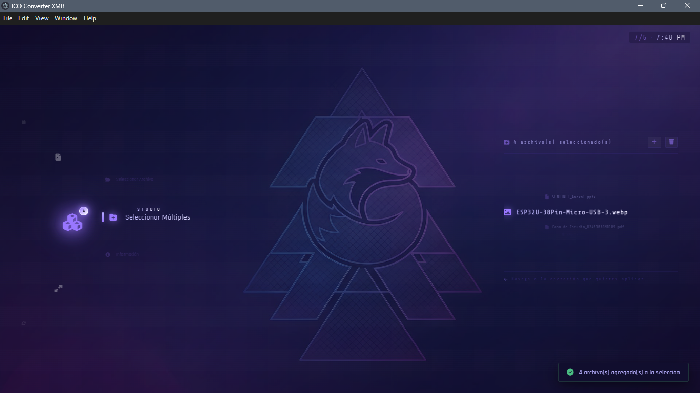

# ICO Converter XMB

<div align="center">

**Conversor de iconos con interfaz inspirada en el XrossMediaBar (XMB) de PS3**


</div>

---

## 📖 Descripción

**ICO Converter XMB** es una aplicación de escritorio construida con Electron que permite convertir, mejorar y proteger archivos de íconos (`.ico`) a través de una interfaz retro inspirada en el **XrossMediaBar** de PlayStation 3.

El proyecto combina procesamiento de imágenes con IA, criptografía y una experiencia de usuario cuidada al detalle, incluyendo un carrusel elíptico animado, sonido sintetizado con Web Audio API, y un diseño visual en tonos índigo/violeta.

---

## ✨ Características

- 🖼️ **Conversión de íconos** — Transforma imágenes a formato `.ico` de forma rápida y por lotes.
- 🔍 **Upscaling con IA** — Mejora la resolución de imágenes usando **Real-ESRGAN** (modelo ONNX).
- 🔐 **Encriptación segura** — Protege archivos con **AES-256-GCM**.
- 📦 **Compresión ZIP** — Empaqueta resultados automáticamente.
- 🎛️ **Interfaz estilo XMB** — Carrusel elíptico giratorio con navegación fluida, inspirado en la PS3.
- 🔊 **Sonido sintetizado** — Efectos de audio generados con Web Audio API, sin archivos de sonido externos.
- ⚡ **Procesamiento por lotes** — Convierte múltiples archivos en una sola operación.

---

## 📸 Capturas de pantalla







## 🛠️ Tecnologías

| Categoría | Tecnología |
|---|---|
| Framework de escritorio | Electron |
| IA / Upscaling | Real-ESRGAN (ONNX Runtime) |
| Encriptación | AES-256-GCM |
| Audio | Web Audio API |
| Backend de procesamiento | Python |

---

## 🚀 Instalación

### Requisitos previos

- [Node.js](https://nodejs.org/) (v18 o superior recomendado)
- [Python](https://www.python.org/) 3.9+ (para el módulo de upscaling)
- Git

### Pasos

1. Clona el repositorio:
   ```bash
   git clone https://github.com/kendoulises05-svg/xmb-icon-studio.git
   cd xmb-icon-studio
   ```

2. Instala las dependencias de Node:
   ```bash
   npm install
   ```

3. Instala las dependencias de Python:
   ```bash
   pip install -r requirements.txt
   ```

4. Configura las variables de entorno:
   - Crea un archivo `.env` en la raíz del proyecto (no incluido por seguridad)
   - Agrega las variables necesarias para la encriptación (ver `.env.example` si está disponible)

5. Descarga los modelos de Real-ESRGAN:
   - Los modelos `.pth` / `.onnx` no están incluidos en el repositorio por su tamaño
   - Colócalos en la carpeta `models/`

---

## ▶️ Uso

Ejecuta la aplicación en modo desarrollo:

```bash
npm start
```

O usa el archivo `run_app.bat` incluido para iniciar rápidamente en Windows.

---

## 📁 Estructura del proyecto

```
ico_converter_xmb_v2/
├── main.js              # Proceso principal de Electron
├── preload.js           # Script de preload
├── script.js             # Lógica del frontend
├── upscaler.py           # Módulo de upscaling con Real-ESRGAN
├── setup_realesrgan.py   # Configuración del modelo de IA
├── fix_basicsr.py        # Utilidad de compatibilidad
├── index_V7.html          # Interfaz principal
├── style_V7.css           # Estilos de la interfaz XMB
├── modelos/               # Versiones anteriores de la interfaz
└── assets/                # Recursos gráficos
```

---

## 🗺️ Roadmap

- [ ] Empaquetado como instalador (`.exe`)
- [ ] Soporte multiplataforma (macOS / Linux)
- [ ] Documentación técnica ampliada

---

## 📄 Licencia

Este proyecto está bajo la licencia **MIT**. Consulta el archivo `LICENSE` para más detalles.

---

## 👤 Autor

**Kendo Ulises**

